<!--
  README for github.com/AZIZ_GITHUB_USERNAME

  Before pushing:
  1. Replace every occurrence of AZIZ_GITHUB_USERNAME below with the real
     GitHub username for this account (find & replace, ~6 spots).
  2. Put assets/glitch-header.svg in an /assets folder in this same repo
     (this file must live in the special repo named exactly your username,
     e.g. github.com/AZIZ_GITHUB_USERNAME/AZIZ_GITHUB_USERNAME).
  3. The contribution snake and GitHub stats cards need a real username to
     resolve — see the "set it up" note further down for the one-time
     Action setup.
-->

<div align="center">




<br/>


<a href="https://wakatime.com/@b71db2da-33e1-4886-96e9-dc295e08a06f"></a>

</div>

<br/>

```
$ cat profile.yaml
```

```yaml
handle: "Aziz Albatany"          # a.k.a AceBreaker
role: Game Programming Student
stack: [Unity / C#, JavaScript, Node.js, Discord.js, Git]
band: Crank — post-hardcore / emo revival
focus: narrative systems & gameplay architecture
languages: [Indonesian, English]
status: probably debugging, or writing riffs
```

<div align="center">


</div>

<br/>

<details>
<summary><b>▶ decrypt more system data</b></summary>
<br/>

### 🎧 last.fm feed

<div align="center">
<a href="https://www.last.fm/user/AceBreaker420">
  
</a>
<a href="https://www.last.fm/user/AceBreaker420">
  
</a>
</div>

<br/>

### 📊 github stats

<div align="center">


</div>

<br/>

### 🐍 contribution snake

<div align="center">
<picture>
  <source media="(prefers-color-scheme: dark)" srcset="https://raw.githubusercontent.com/albatany/albatany/output/github-snake-dark.svg" />
  <source media="(prefers-color-scheme: light)" srcset="https://raw.githubusercontent.com/albatany/albatany/output/github-snake.svg" />
  
</picture>
</div>

<details>
<summary><sub>set it up (one-time, ~2 minutes)</sub></summary>
<br/>

Create `.github/workflows/snake.yml` in this repo:

```yaml
name: generate snake animation
on:
  schedule:
    - cron: "0 */6 * * *"
  workflow_dispatch: {}
  push:
    branches: [ main ]

permissions:
  contents: write

jobs:
  generate:
    runs-on: ubuntu-latest
    steps:
      - uses: Platane/snk/svg-only@v3
        with:
          github_user_name: ${{ github.repository_owner }}
          outputs: |
            dist/github-snake.svg?color_snake=#00ff41&color_dots=#0d0208,#123822,#0f5c33,#00a83b,#00ff41
            dist/github-snake-dark.svg?palette=github-dark
      - uses: crazy-max/ghaction-github-pages@v4
        with:
          target_branch: output
          build_dir: dist
        env:
          GITHUB_TOKEN: ${{ secrets.GITHUB_TOKEN }}
```

Push it once, let the Action run, and the snake above lights up on its own — no further edits needed.

</details>

<br/>

### 📡 contact

<div align="center">


<a href="https://instagram.com/azizblvd/"></a>
<a href="https://open.spotify.com/user/31acau4fmp7lixasqx5w4fgnz5zi"></a>

</div>

<br/>

<div align="center">
<sub>root@albatany:~$ cd ../<a href="https://github.com/AceBreaker-Cell">AceBreaker-Cell</a>&nbsp;&nbsp;<i># same person, other terminal</i></sub>
</div>


</details>
